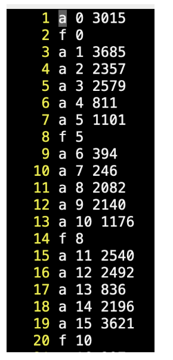

## 팀프로젝트 x 개방형 문제 메모리 할당자 시뮬레이터
메모리는 컴퓨터에서 중요한 자원 중에 하나이다. 연속된 메모리 공간을 가변 크기의 메모리 공간 요청에 따라 할당하는 메모리 할당자 (ssualloc) 시뮬레이터를 구현한다.

### 1. 구현할 사항
ssualloc 시뮬레이터에서 메모리 관리는 아래와 같이 구현되어야 한다.
- allocator/allocator.py 를 수정하여 구현
- input.txt 에 있는 할당 / 해제 요청을 처리해야 한다.
  | </img> | 명령어 일련번호 요청크기 a: allocate 명령어 (할당)  f: free 명령어 (해제)|
  |--|--|
 
- 할당자는 OS로부터 4KB (또는 16KB) 크기의 chunk 단위로 할당받아 arena 라는 메모리 풀을 관리하고 있으며, 사용하지 않는 chunk 는 OS에게 반납할 수 있다.
- 사용자 응용의 가변 크기 메모리 할당 요청 시 메모리풀에서 할당하며, 공간 부족 시 chunk 단위로 OS에게 할당 받는다.
- 해제 요청은 요청의 일련번호와 함께 주어지며, 해제된 공간은 free space 로 관리되어야 한다.
- 메모리 관리(할당/해제 등)에 필요한 자료구조 및 알고리즘은 자유롭게 설계한다.
  
### 2. 성능평가
- 할당/해제 알고리즘에 대한 시간복잡도 분석
- 실제 시뮬레이션 시간
- 공간활용률 = 실제사용량 / 메모리풀크기

### 3. 수행방식 및 제출물
- 4인1팀으로 구성
- 프로그램 설계 기술서 제출 : 5/26(일) 23:59 / 개인 수행
    - 전체 자료구조
    - 전체 알고리즘에 대한 간략한 설명 
    - 시간복잡도 분석
- 프로그램 구현물 제출: 6/2(일) 23:49 / 개인 수행 (팀원 간의 아이디어 레벨 수준의 토의 가능)
    - 코드 (주석 포함)
    - 결과물 (수행 시간, 실제 사용량, 총 사용량, 공간 활용률)
- 팀원 토론: 6/3(월) 수업시간
    - 상호 접근 방식을 토론하고, 최적의 알고리즘을 선정하거나 추가 최적화 수행
- 발표: 6/10 팀별 1명 발표
    - 팀원들의 접근 방법 소개 및 각 기법의 성능 분석결과 발표 > 최대 5분

### 4. 평가기준
- 정답이 없는 문제임.
- 총300점:개인구현200점/발표100점
- 얼마나 깊이 고민 했는가?
- 얼마나 구현을 정확히 했는가?
- 얼마나 성능분석을 정확/치밀하게 했는가?
- 얼마나 결과를 잘 전달하는가?
